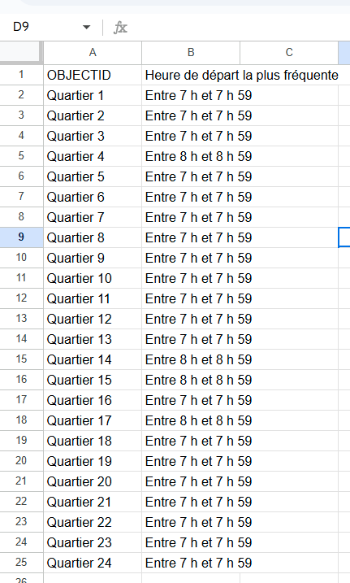
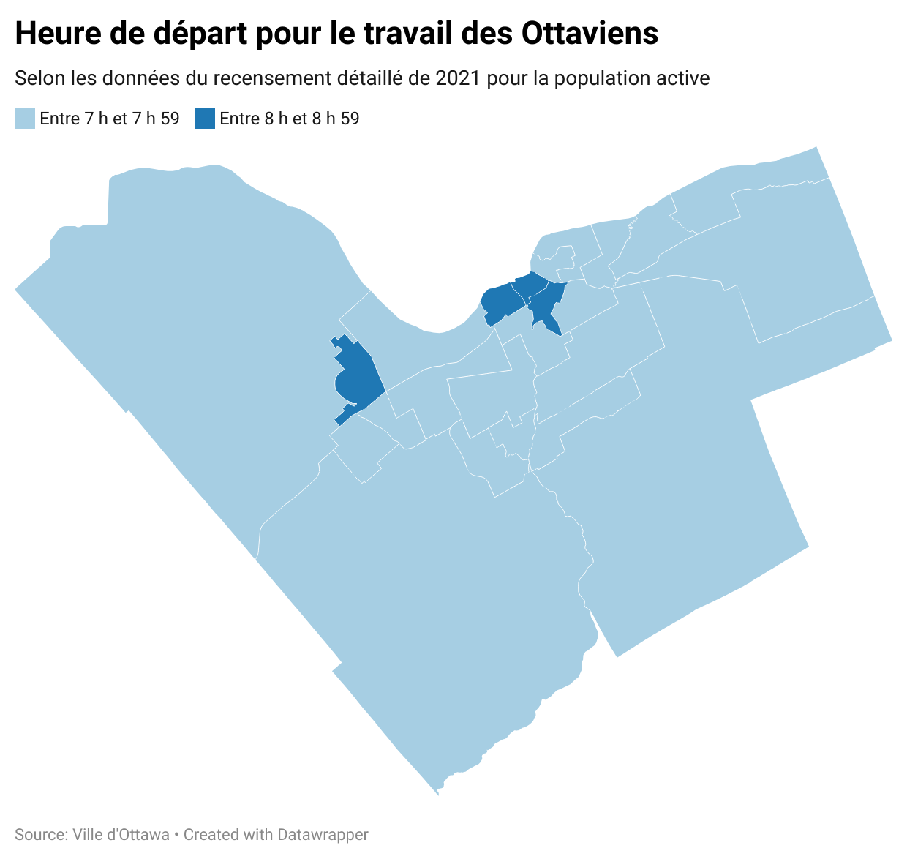
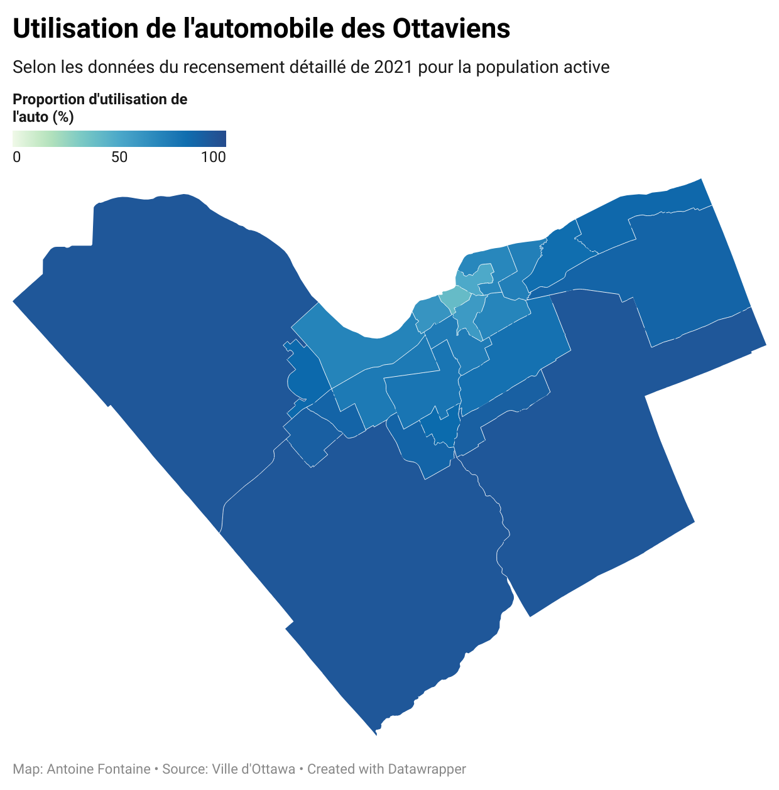

**Date**<br>
**Cote et nom du cours**<br>
**Prénom et nom de l'étudiant(e)**<br>
**Présenté à Jean-Sébastien Marier**<br>

# Analyse exploratoire de données (AED) et proposition

Utilisez un croisillon (`#`) pour créer un intertitre de niveau 1 comme celui-ci.

## Avant-propos

Pour ce travail, vous devez extraire des données d’un site Internet ou d’une base de données. Vous devez ensuite nettoyer et analyser votre jeu de données, trouver une histoire potentielle et créer une visualisation. Votre travail doit clairement expliquer votre processus. Vous devez écrire environ 1500 à 2000 mots et inclure des captures d’écran montrant les différentes étapes de votre analyse. Votre travail doit être rédigé avec le format Markdown et être publié sur GitHub.

J'assigne différentes versions de ce projet à mes étudiants en journalisme numérique et en « data storytelling » depuis déjà quelques années. La structure générale de ce travail est basée sur celle du [*Guide du datajournalisme*](http://jplusplus.github.io/guide-du-datajournalisme/index.html). La présente version est également inspirée du programme [Key Capabilities in Data Science](https://extendedlearning.ubc.ca/programs/key-capabilities-data-science) offert par l'Université de la Colombie-Britannique (UBC).

**Voici quelques ressources utiles pour ce travail :**

* [Page *Syntaxe de base pour l’écriture et la mise en forme* de GitHub](https://docs.github.com/fr/get-started/writing-on-github/getting-started-with-writing-and-formatting-on-github/basic-writing-and-formatting-syntax)
* [Le répertoire modèle pour ce projet au cas où vous effaceriez quelque chose par accident](https://github.com/jsmarier/jou4100_jou4500_mpad2003_project2_template)

Avez-vous remarqué comment créer un hyperlien? En langage Markdown, on met le texte cliquable entre une paire de crochets et l'adresse URL entre parenthèses.

Pour créer une liste non ordonnée, il suffit de mettre une étoile (`*`) devant chaque item.

## 1. Introduction

Insérez votre texte ici.

## 2. Obtenir les données

Utilisez deux croisillons (`##`) pour créer un intertitre de niveau 2 comme celui-ci.

Utilisez le modèle de code ci-dessous pour insérer une capture d'écran. Vos images doivent être sauvegardées dans le même dossier que votre fichier `.md`.

<br>
*Figure 1 : La fenêtre d'importation d'un fichier de Google Feuilles de calcul.*

**Voici quelques exemples de fonctions et de lignes de code mises dans des boîtes grises :**

1. Si vous nommez une fonction, mettez là à l'intérieur de guillemets « inclinés » comme ceci : `IMPORTHTML`.
1. Si vous voulez inclure une ligne de code complète, faites la même chose, mais avec tout le code : `=IMPORTHTML("https://en.wikipedia.org/wiki/China"; "table", 5)`.
1. Alternativement, vous pouvez mettre le code dans une boîte indépendante en utilisant le modèle de code ci-dessous :

``` r
=IMPORTHTML("https://en.wikipedia.org/wiki/China"; "table", 5)
```
C'est aussi comme ça qu'on crée une liste ordonnée. Il suffit de mettre `1.` devant chaque item.

## 3. Comprendre les données

### 3.1. Analyse VIMA

Utilisez trois croisillons (`###`) pour créer un intertitre de niveau 3 comme celui-ci. Je vous prie de suivre ce modèle en ce qui a trait aux intertitres de niveaux 1 et 2. Toutefois, je vous laisse le loisir d'utiliser les intertitres de niveau 3 comme bon vous semble.

Insérez votre texte ici.

Appuyez vos affirmations en citant les sources appropriées. Veuillez suivre les [normes APA en matière d'attribution dans le corps du texte](https://apastyle.apa.org/style-grammar-guidelines/citations).

**Par exemple :**

Comme l'affirme Cairo (2016), une visualisation de données doit être véridique...

### 3.2. Nettoyage des données

Insérez votre texte ici.

### 3.3. Analyse exploratoire des données (AED)

Nous analyserons ici quelques variables sur les moyens de transport des Ottaviens. Afin de déterminer quelle est l’heure de pointe dans les différents quartiers de la Ville d’Ottawa, nous avons recensé l’heure de départ la plus fréquente pour chacun des quartiers de la ville. Voici les résultats : 

**Tableau croisé**
<br>
*Figure 1 : Ce tableau croisé dynamique montre l'heure de départ la plus fréquente des Ottaviens par quartier.*

**Carte**
<br>
*Figure 2 : Cette carte montre quelle est l'heure de départ la plus fréquente dans les différents quartiers d'Ottawa.*

Nous pouvons remarquer qu’à part pour les trois quartiers les plus près du centre-ville et pour Kanata-Nord, l’heure de départ la plus fréquente des Ottaviens est entre 7 h et 7 h 59. J’émets pour l’instant l’hypothèse que la majorité des gens habitants Kanata-Nord y travaillent, en raison du hub de technologie et de recherche qui s’y trouve.

Les gens auraient donc une moins grande distance à parcourir pour se rendre au travail. Ce pourrait également être le cas pour le centre-ville et ses édifices gouvernementaux et ses sièges sociaux. Le tout est à confirmer dans une analyse plus poussée. Nous pourrions analyser les sections sur l’industrie de travail de la population du jeu de données pour ce faire ou interroger des organisations (syndicats, associations de quartiers) locales.

Ensuite, nous souhaitons explorer à quel point les différents quartiers sont dépendants de l’automobile. En jetant un coup d’oeil rapide au tableau des données du recensement, nous pouvons remarquer que l’automobile est le moyen de transport le plus fréquent dans tous les quartiers, en proportions différentes. Les voici : 

**Tableau croisé**
<br>
*Figure 3 : Ce tableau croisé dynamique montre la proportion d'automobilistes par quartier.*

**Carte**
<br>
*Figure 4 : Cette carte montre la proportion d'automobilistes par quartier.*

Nous pouvons constater que plus les Ottaviens habitent près du centre-ville, moins ils se déplacent en voiture.

Dans le quartier Sommerset (14) par exemple, c’est environ 40 % de la population qui se déplace en auto. Cette proportion dépasse 93 % dans les quartiers les plus éloignés (5, 20 et 21).

Il pourrait être intéressant de comparer ces données avec l’offre de transport en commun et de pistes cyclables pour trouver quels sont les facteurs qui encourage l’utilisation de l’automobile, du vélo ou de la marche pour se déplacer.

## 4. Récit potentiel

Les données de la première analyse nous servent de point de départ afin de déterminer l’heure de pointe à Ottawa. Nous savons maintenant que la majorité des Ottaviens partent le matin entre 7 h et 7 h 59.

C’est le cas dans la plupart des quartiers. Cette analyse manque cependant de contexte pour en faire une histoire complète. L’heure de pointe matinale ne se résume pas à l’heure de départ, mais aussi au moyen de transport utilisé, à la distance à parcourir pour se rendre au travail et dépend également de la situation géographiqe des différents pôles d’emploi de la ville.

Le jeu de données peut répondre à certaines de ces questions. Nous l’avons vu dans la deuxième analyse sur l’utilisation de l’autombile selon les quartiers. Pour en savoir davantage sur le déroulement de l’heure de pointe, nous pourrions également interroger un chroniqueur à la circulation. Le travail de ces personnes consiste généralement à rapporter les événements qui se produisent sur le réseau routier dans les médias (surtout à la radio) et connaissent donc très bien les habitudes de déplacement des gens de leur région.

L’heure de pointe est également vécue différemment selon si l’on vit au centre-ville ou en périphérie, ou encore si on est un usager du transport en commun ou un automobiliste. Il serait donc intéressant d’intéroger des représentants d’association d’usagers du transport en commun comme [le groupe des usagers de transport en commun d'Ottawa](https://www.ottawatransitriders.ca/about) (Le groupe des usagers de transport en commun d'Ottawa, n.d.) ou encore une association d’un quartier où l’heure de pointe est particulièrement dense pour les automobilistes. À Stitsville par exemple, un automobiliste rapporte dans [le Ottawa Citizens devoir attendre jusqu’à 90 minutes dans la circulation sur l’autoroute 417](https://ottawacitizen.com/feature/why-is-traffic-so-bad-on-highway-417-in-ottawa) (Baldin, 2025). Selon cet article, des travaux de construction sur l’autoroute seraient notamment en cause. La qualité du service d’OC Transpo et le retour au bureau des fonctionnaires est également mentionné. On pourrait également questionner des syndicats de fonctionnaires fédéraux. [Ces derniers avaient exprimé des craintes lors de l’annonce du retour au bureau trois jours par semaine](https://ici.radio-canada.ca/nouvelle/2102251/retour-bureau-fonctionnaire-oc-transpo-sto-ottawa-gatineau) (Côté-Sroka, 2024) quant aux transports à l’heure de pointe, selon cet article de Radio-Canada.

## 5. Conclusion

Insérez votre texte ici.

## 6. Références

Baldin, N. (2025, October 29). *Why is traffic so bad on Highway 417 in Ottawa?* Ottawa Citizen. Retrieved November 7, 2025, from https://ottawacitizen.com/feature/why-is-traffic-so-bad-on-highway-417-in-ottawa

Côté-Sroka, E. (2024, September 5). *Plus de jours au bureau, mais pas plus d’autobus pour les fonctionnaires.* Radio-Canada. Retrieved November 7, 2025, from https://ici.radio-canada.ca/nouvelle/2102251/retour-bureau-fonctionnaire-oc-transpo-sto-ottawa-gatineau

Le groupe des usagers de transport en commun d'Ottawa. (n.d.). *À propos de nous.* https://www.ottawatransitriders.ca/. https://www.ottawatransitriders.ca/about

**Voici un exemple :**

Bounegru, L., & Gray, J. (Eds.). (2021). *The Data Journalism Handbook 2: Towards A Critical Data Practice*. Amsterdam University Press. [https://ocul-crl.primo.exlibrisgroup.com/permalink/01OCUL_CRL/hgdufh/alma991022890087305153](https://ocul-crl.primo.exlibrisgroup.com/permalink/01OCUL_CRL/hgdufh/alma991022890087305153)

